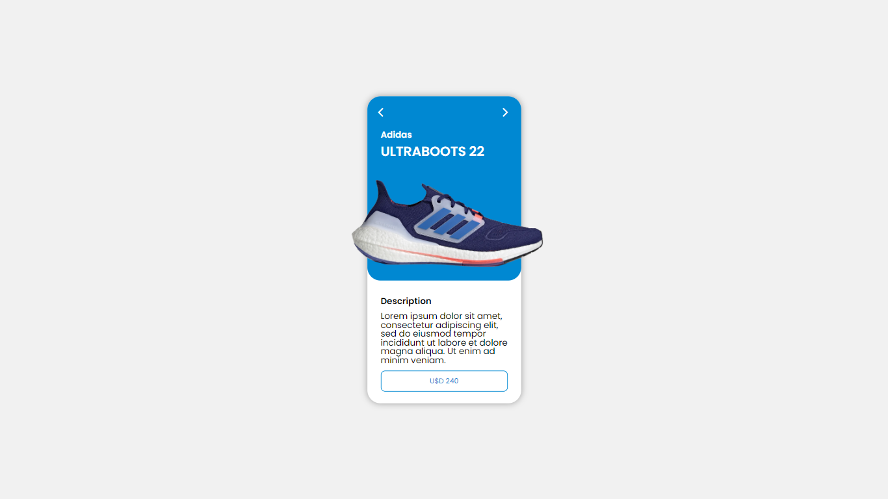

# Card-with-Carousel-
<h5>EN - Simple card that uses javascript to manipulate the CSS thus creating an image carousel.</h5>
<h5>PT - Card simples que usa javascript para manipular o CSS criando assim um carrossel de imagens.</h5>

<h4>Deploy: https://johnandrade65.github.io/Card-with-Carousel-/</h4>

 
  
  
  

